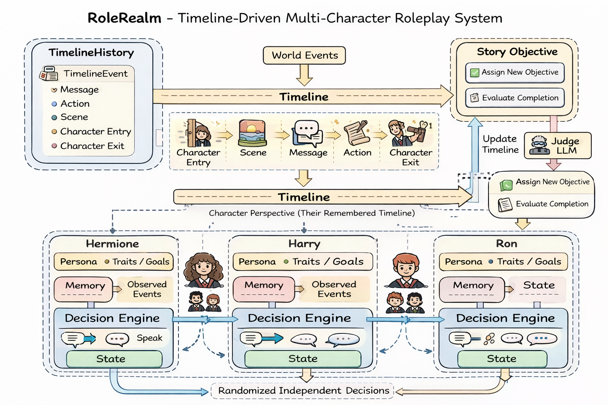

# RoleRealm-A-Story-Driven-Roleplay


[](https://opensource.org/license/MIT)
[](https://github.com/Jit-Roy/RoleRealm/pulls)
[](https://openrouter.ai/)

An interactive AI-powered roleplay system that brings characters to life through dynamic conversations and story-driven experiences.



## Screenshots

<table>
  <tr>
    <td></td>
    <td></td>
  </tr>
</table>

## Features

- **Dynamic Character Interactions** - Create and interact with multiple AI characters, each with unique personalities and speaking styles
- **Natural Conversations** - Advanced conversation management with full context awareness
- **Story Progression System** - Structure your narratives with story arcs, scenes, and objectives
- **Persistent Sessions** - Automatic chat history and story state saving
- **Context Awareness** - Characters remember past interactions across sessions
- **Multi-Character Support** - Seamlessly manage conversations with multiple AI characters

## Getting Started

### Prerequisites

- Python 3.8+
- OpenRouter API key

### Installation

1. Clone the repository:
```bash
git clone https://github.com/Jit-Roy/RoleRealm.git
cd RoleRealm
```

2. Install dependencies:
```bash
pip install -r requirements.txt
```

3. Create a `.env` file and add your OpenRouter API key:
```
OPENROUTER_API_KEY=your_api_key_here
```

### Running RoleRealm

Simply run the main script:
```bash
python main.py
```

## Project Structure

```
RoleRealm/
├── main.py                 # Main entry point
├── [Story Name]/           # Story-specific folders (e.g., "Pirate Adventure")
│   ├── characters/         # Character definition JSON files for this story
│   ├── story/              # Story JSON file (single file per story)
│   └── [story_name]_chat.json  # Saved conversation history for this story
├── managers/               # Core system managers
│   ├── characterManager.py
│   ├── timelineManager.py  # Unified timeline management (messages + scenes)
│   ├── storyManager.py
│   └── turn_manager.py
├── loaders/                # Data loaders
│   ├── character_loader.py
│   └── story_loader.py
├── helpers/                # Helper utilities
│   └── response_parser.py
└── config.py               # Configuration settings
```

For more info visit [docs/README.md](docs/README.md)

## Customization

### Creating a New Story

1. Create a new folder with your story name (e.g., `My Adventure`)
2. Inside, create two subfolders:
   - `characters/` - For character JSON files
   - `story/` - For the story JSON file (single file only)

### Creating Characters

Define characters in JSON format in the `[Story Name]/characters/` folder. Each character should include:
- Name and traits
- Speaking style
- Background and relationships
- Goals and knowledge base

### Creating Stories

Design your story in JSON format in the `[Story Name]/story/` folder with:
- Story title and description
- Sequential objectives (list of objectives to achieve)
- Story progression logic

## Contributing

Contributions are welcome! Feel free to submit issues or pull requests.

## License

This project is open source and available under the MIT License.
